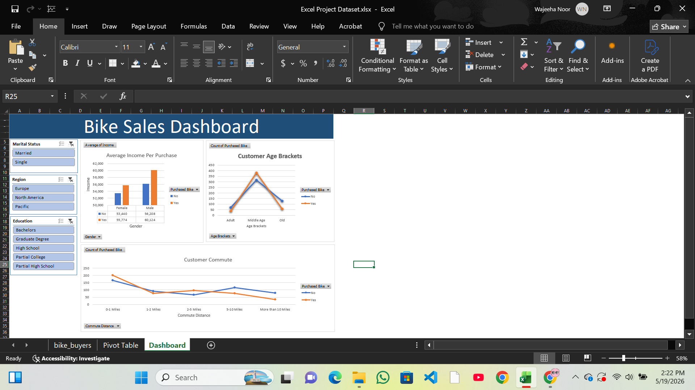

# Bike Sales Dashboard (Excel)

A comprehensive Excel-based analytical dashboard for tracking and visualizing bike sales metrics across multiple dimensions including customer demographics, purchasing behavior, and geographic regions.

## 📊 Project Overview
This project contains an interactive Excel dashboard built to analyze bike sales data with a focus on understanding customer purchasing patterns, income trends, and commute behavior across different demographic segments.

## 🎯 Key Features

**Interactive Filters**
- Marital Status: Filter data by Married or Single customers
- Region: Analyze performance across Europe, North America, and Pacific regions
- Education Level: Segment customers by Bachelors, Graduate Degree, High School, Partial College, and Partial High School

**Dashboard Visualizations**
1. **Average Income Per Purchase** — Bar chart comparing income levels across gender segments, broken down by purchased bike status
2. **Customer Age Brackets** — Line chart showing customer distribution across age groups (Adult, Middle Age, Old), comparing purchased vs. non-purchased
3. **Count of Purchased Bikes** — Overview of total bike purchases segmented by customer attributes
4. **Customer Commute Distance** — Multi-distance analysis (0–1, 1–2, 2–5, 5–10, 10+ miles), comparing purchased vs. non-purchased segments

**Data Sheets**
- `bike_buyers` — Raw customer and sales transaction data
- `Pivot Table` — Aggregated data for dashboard visualizations
- `Dashboard` — Interactive visualization hub with slicers and charts

## 💡 Key Findings
- Customers who purchased a bike had consistently higher average income than those who didn't, across both genders (e.g. male buyers averaged $60,124 vs. $56,208 for non-buyers)
- Shorter commute distances (0–1 miles) were associated with a higher likelihood of purchase, with the gap narrowing at longer distances
- Middle-age customers made up the largest segment in both purchased and non-purchased groups, suggesting age alone is a weaker predictor of purchase than income or commute distance

## 📁 File Structure
